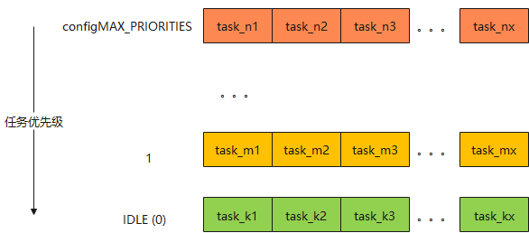
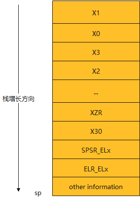

## FreeRTOS 之任务调度

调度，实际涉及到两个问题，一个是调度的对象是什么（你要调度啥），另一个就是如何进行调度。本文就来聊聊 FreeRTOS 的任务调度过程。

说到调度对象，很容易想起那句名言：进程是资源的最小单位，线程是调度的最小单位。在 FreeRTOS 中没有区分进程，线程的概念，统称为任务，对应的结构体为：tskTCB。

```c
lib/FreeRTOS/tasks.c

typedef struct tskTaskControlBlock {
	volatile StackType_t *pxTopOfStack;				/*栈顶指针*/
	ListItem_t xStateListItem;						/*状态链表*/
	ListItem_t xEventListItem;						/*事件链表*/
    UBaseType_t uxPriority;							/*优先级*/
    StackType_t *pxStack;							/*栈起始地址*/
    StackType_t uStackDepth;						/*栈大小*/
    char pcTaskName[ configMAX_TASK_NAME_LEN ];		/*任务名*/
} tskTCB;
```

可以看到一个任务的资源包括：栈顶指针，状态链表，事件链表，栈起始地址，栈大小，任务名。还有一些可选项，如锁，任务通信相关的资源等，可以通过宏进行开关。本文仅仅讲述的是调度，所以对扩展项进行忽略。有了对象，就可以进行调度了。

FreeRTOS 是一个实时操作系统，它所奉行的调度规则：

1. 高优先级抢占低优先级任务，系统永远执行最高优先级的任务。
2. 同等优先级的任务轮转调度。

具体的实现如下图所示：



​																				图 1

可以看到每个优先级都对应一个循环链表，同一优先级的任务都在同一级链表上。任务调度实际就是找到最高优先级的任务，然后调度它。如何找到最高优先级的任务呢？概括起来就一句话：

从高到低遍历优先级链表，如果链表不为空，就返回该链表中的下一个元素。

从高到低遍历保证了找到的任务是最高优先级的，而返回该链表中的下一个元素，就实现了任务轮转。如果该链表上有多个任务，那么就会执行下一个同等优先级的任务，如果只有一个任务，那还是执行它本身。这样就保证系统永远在执行最高优先级的任务。对应的函数：

```c
lib/FreeRTOS/tasks.c:

#define taskSELECT_HIGHEST_PRIORITY_TASK() \
{ \
	UBaseType_t uxTopPriority = uxTopReadyPriority; \
	/*遍历链表*/
	while ( listLIST_IS_EMPTY( &( pxReadyTasksLists[ uxTopPriority ] ) ) ) \
	{ \
		configASSERT( uxTopPriority ); \
		--uxTopPriority; \
	} \
    /*获取该优先级链表上的下一个成员*/
	listGET_OWNER_OF_NEXT_ENTRY( pxCurrentTCB, &( pxReadyTasksLists[ uxTopPriority ])); \
	uxTopReadyPriority = uxTopPriority; \
}
```

以上就是任务调度最核心的部分，看上去很简单，但心中不免留下了两个疑问：

1. 优先级链表（也就是图1）是怎么构建出来的？
2. 调度策略是怎么和任务挂钩的，也就是如何进行任务切换的问题？

要想回答第一问题，就要知道任务是怎么被创建出来的。在 FreeRTOS 中，创建任务只有一个 API：

```c
BaseType_t xTaskCreate( TaskFunction_t pxTaskCode,					/*任务函数*/
						const char *char const pcNmae,				/*任务名*/
						const configSTACK_DEPTH_TYPE usStackDepth,  /*栈大小*/
						UBaseType_t uxPeriority,					/*任务优先级*/
						TaskHandle_t * const pxCreatedTask )		/*任务句柄*/
```

可以看到该函数的参数对应的就是结构体 tskTCB 中的成员。而函数的实现，首先分配一块 tskTCB 大小的空间，然后初始化里面的变量，如填充任务名，设置优先级，分配栈空间等。而这块内存实际就是task了，通过调用如下函数就将 task 添加到了就绪态链表中：

```c
lib/FreeRTOS/tasks.c:

static List_t pxReadyTasksList[ configMAX_PRIORITES ];

#define prvAddTaskToReadyList( pxTCB ) \
		vListInsertEnd( &( pxReadyTasksLists[ ( pxTCB )->uxPriority ] ), &( ( pxTCB )->xStateListItem ) );
```

pxReadyTasksList[] 是个静态全局变量，元素是链表，大小为 configMAX_PRIORITES，也就是说任务优先级最高可以为 configMAX_PRIORITES - 1，0 为 最低的优先级，IDLE task 的优先级就是 0.

从 prvAddTaskToReadyList() 函数可以看出，pxReadyTasksList 数组是根据创建的任务优先级进行初始化的。比如创建任务时指定的优先级都是2，那么此时只有 pxReadyTasksList[2] 和 pxReadyTasksList[0] 成员被初始化，0优先级的链表是系统默认创建的（当用户不创建任务的时候，系统就运行 IDLE 任务）。这样做的好处就是，从高到低遍历的时候，如果该数组值为空，表示没有该优先级的任务，直接进入下一级比较。

以上就构建出了图 1 的优先级链表。

对于第二个问题，如何将任务和调度策略挂钩起来，进行任务切换的？？

任务切换就是一个“辞旧迎新”的过程，总结起来可以分为三步：

1. 保存上一个 task 的上下文
2. 找到下一个要执行的 task
3. 让新的任务从它上次被打断的地方开始执行

关键代码如下所示：

```asm
lib/FreeRTOS/portable/GCC/ARM_CA53_64_BIT/portASM.S:

	portSAVE_CONTEXT			/*保存当前任务的上下文到当前任务栈中*/
	BL vTaskSwitchContext		/*挑选下一个最高优先级任务*/
	portRESTORE_CONTEXT			/*从新任务的栈中加载上下文信息，并运行新任务*/
```

所谓的上下文就是一些寄存器和系统状态信息，不同架构体系的寄存器可能不一样，这里就以 ARMv8 64bit为例进行说明，而且栈的增长方向是从高地址往低地址。



​																								图 2

可以看到，保存的信息包括：X0 ~ x30 寄存器，SPSR 寄存器，ELR 寄存器，还有一些其他信息，与调度无关就不多做说明了。portSAVE_CONTEXT() 和 portRESTORE_CONTEXT() 函数就是根据图 2 结构进行一个 save/restore 的过程。vTaskSwitchContext() 函数里面会调用 ```taskSELECT_HIGHEST_PRIORITY_TASK();``` 函数，选择下一个最高优先级的任务。这样就和上面的调度策略挂钩起来了。

这里有个细节，任务切换是根据图 2 所示的栈结构进行切换的，当一个任务第一次执行的时候，从哪去加载这些栈信息呢？难道这个任务一出生就有了？是的，在创建任务的时候会调用如下函数去初始化这个栈结构。

```c
lib/FreeRTOS/portable/GCC/ARM_CA53_64_BIT/port.c:

StackType_t *pxPortInitialiseStack( StackType_t *pxTopOfStack, TaskFunction_t pxCode, void *pvParameters );
```

从实现来看就是在栈中填入一些初始化值，并将任务函数，以及参数填入栈中。其关键数据如下图所示：


可以看到填充的结构和图3所示的结构是一致的。有的寄存器在第一次执行的并不影响任务执行，所以被初始化了任意值，但任务函数的参数保存到了 X0 寄存器的位置，任务函数本身地址被保存到了 ELR 寄存器的位置。这样做的目的就是在 portRESTORE_CONTEXT() 函数加载该栈结构后，执行 ERET 指令，系统就跳转到 ELR 寄存器中的地址去执行，也就是任务函数中。

所以在系统运行时，我们直观看到的就是，系统在任务函数之间来回执行。

到了这里，调度对象知道了，如何调度也知道了。看似结束了，但是心中难免还有点疑惑：谁来调度呢？？

举个例子：系统中有两个同等优先级的任务：task1 和 task2，而且在就绪态队列中，它们的优先级是最高的，也就是说，此时系统中就它们兄弟俩在运行了，task1在执行的时候， 如果它不主动放弃 CPU，它就会一直执行，那么什么时候才能轮到 task2 执行呢？？

所以此时需要一种机制能打断 task1 的执行，然后切换到 task2，后面在 task2 执行的时候，也能从 task2 中收回 CPU 的控制权，然后交给 task1，并且要让 task1 从上次被打断的地方开始执行。

通用的方法就是周期性的触发中断（一般称为 Tick 中断），在中断处理函数中，保存上一个任务的上下文，然后切换到下一个任务中。在 FreeRTOS 中使用一个硬件 timer 作为 Tick 中断。如果将 Tick 中断配置为 1ms 来一次，那么系统就会 1ms 进行一次任务切换。

至于中断来了怎么跑到对应的中断处理函数中，这个是和芯片中的中断控制器相关的，不同的中断控制器有不同的配置方法，本文就不细说了。总之，在 tick 中断的中断处理函数中做的事情是一样的，就是上面所描述的任务切换。

至此，FreeRTOS 任务调度的疑问已经全部解决了，本文也就到此结束了。


